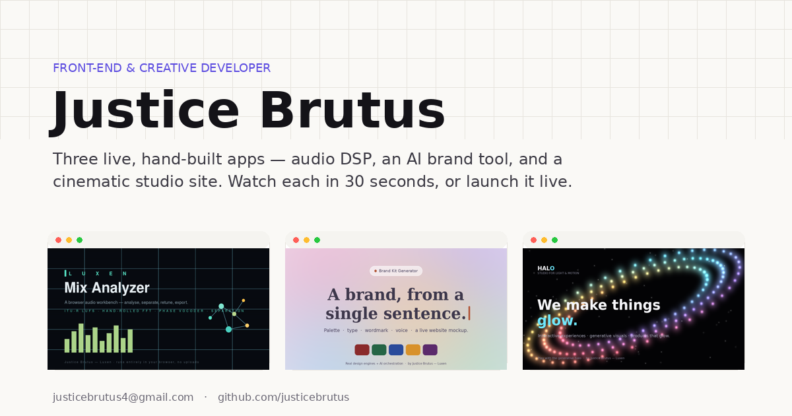

<div align="center">



# Justice Brutus — Interactive Résumé

**A coded personal site where you can watch a 30-second tour of each project or launch the real app live, right in the page.**

[**▶ Live**](https://justice-portfolio-nine.vercel.app) &nbsp;·&nbsp; [Run it locally](#run-it-locally)

</div>

---

## What it is

An interactive résumé — the page is itself a hand-coded React app. Each project sits in a browser-framed screen with three states: a **poster**, a **short video tour**, and the **live app embedded in an iframe**. Plus the essentials: skills, experience, a downloadable PDF résumé, and contact.

Featured work (all live):
- [Luxen Mix Analyzer](https://luxen-mix-analyzer.vercel.app) — hand-rolled audio DSP, zero dependencies.
- [Brand Kit Generator](https://brand-kit-generator-five.vercel.app) — AI orchestration + real design engines.
- [HALO](https://halo-studio-pied.vercel.app) — cinematic studio site with an interactive generative halo.

## Video tours

Each project has a 40–65s screen-captured tour in `public/videos/` (H.264 mp4, 720p, compressed for fast loading). If a video is ever missing, the component falls back to the poster image with "Try it live" — the site stays functional either way.

## Run it locally

```bash
npm install
npm run dev      # http://localhost:5173
```

## Tech

React 18 + Vite + Tailwind CSS. No dependencies beyond React. Accessible (WCAG AA contrast, keyboard-operable, reduced-motion aware).

## License

Source under the [MIT License](LICENSE). © Justice Brutus.
